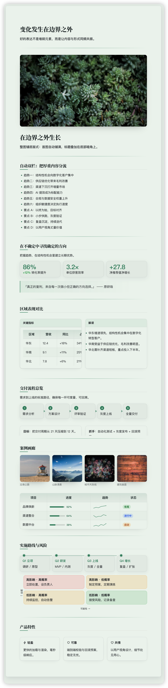
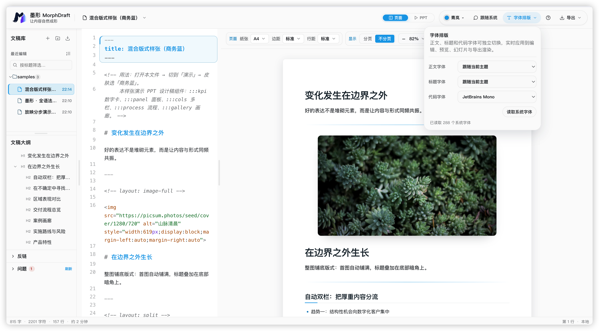
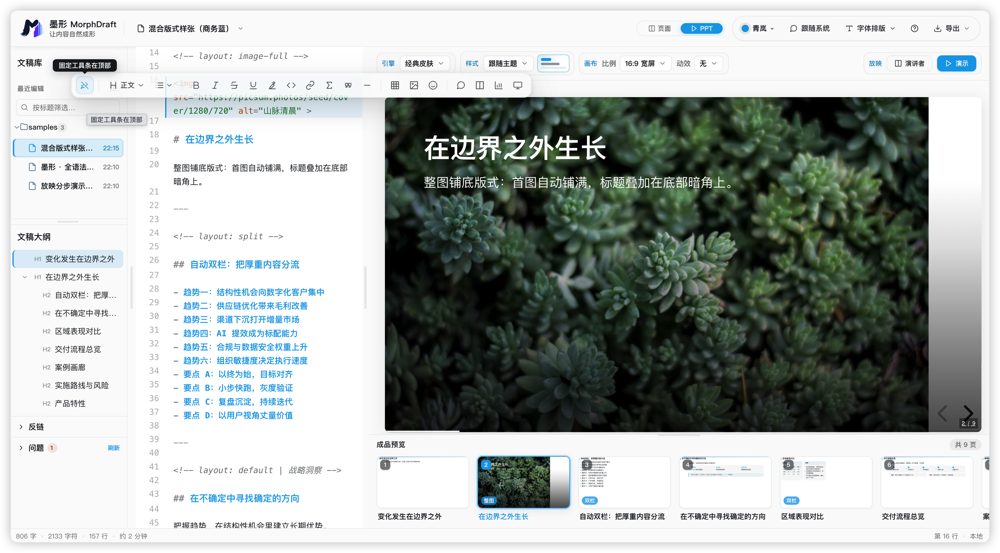
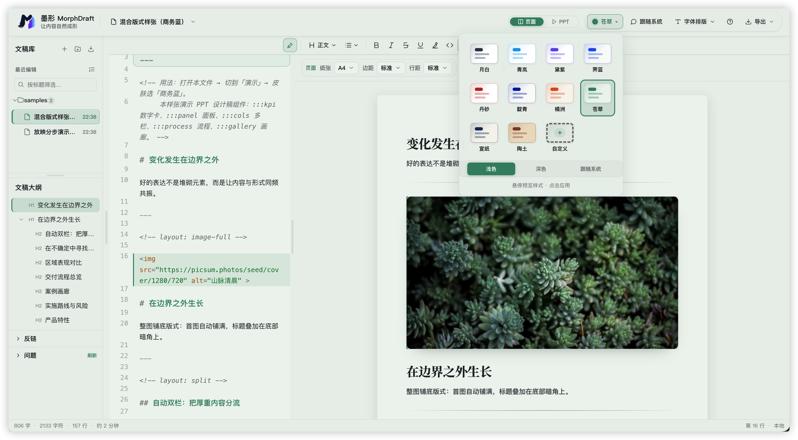
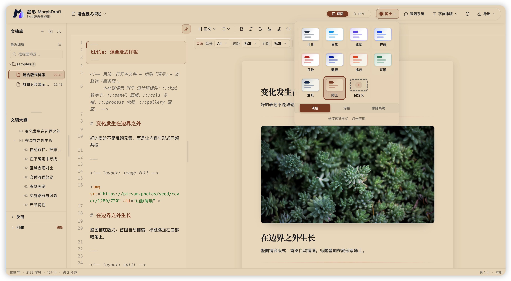
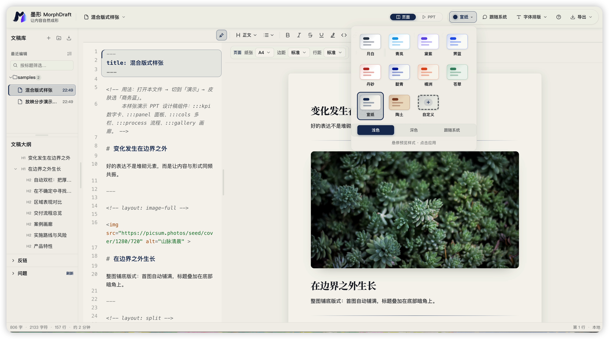

<div style="margin: auto">


# 墨形 · MorphDraft

**让内容自然成形** — 本地优先的 Markdown 文档 & 演示编辑器
*Write once in Markdown. Get a polished document **and** a presentation-grade deck.*

<br/>

[](https://vuejs.org/)
[](https://www.typescriptlang.org/)
[](https://vitejs.dev/)
[](https://tauri.app/)
[](#开发与测试)
[](#许可)
[](#参与贡献)

[功能特性](#功能特性) · [快速开始](#快速开始) · [语法速查](#markdown-语法速查) · [技术栈](#技术栈) · [贡献](#参与贡献)

</div>

---

**MorphDraft（墨形）** 是一个**纯本地、隐私优先**的编辑器。用一份 Markdown，既能写出排版精良的长文档，也能**一键直出演示级 PPT**——配合 Mermaid / ECharts 图表、KaTeX 公式与内置版式组件，无需逐页排版即可得到高质量的幻灯片。

所有数据都保存在你自己的设备上：**不联网、不上传、不依赖任何服务端**。

  <div style="margin: auto"></div>

---

##  功能特性

###  一份内容，两种成品
- **双栏所见即所得** — 左侧 CodeMirror 源码、右侧预览，支持在预览里**原地编辑**，源码 ↔ 预览双向滚动同步。

- **文档模式** — 精排长文：标题层级、代码高亮、表格、引用、脚注、数学公式一应俱全。

  <div style="margin: auto"></div>

- **演示模式** — 同一份 Markdown 实时渲染为 [reveal.js](https://revealjs.com/) 幻灯片，自动分页、自动版式。

  <div style="margin: auto"></div>

- **自定义主题** 支持多种主题色切换，并支持自定义主题色

  <div style="margin: auto">
  </div>
  
  <div style="margin: auto"></div>
  
  <div style="margin: auto"></div>

###  直出演示级 PPT
| 能力 | 说明 |
| --- | --- |
| **9 种版式** | 封面 / 章节 / 居中 / 正文 / 双栏 / 栅格 / 图左 / 图右 / 整图铺底 |
| **智能 + 手动布局** | 按内容自动推断版式（★推荐），也可在缩略图里逐页指定 |
| **40 套视觉皮肤** | 成套设计语言：字母角标页眉、页脚品牌、白面板卡、KPI 数字卡、斑马表 |
| **进入动效** | 上浮 / 淡入 / 聚光 / 级联 / 电影感等切页动画 |
| **拖拽重排** | 预览里直接拖动正文块上下重排，源码同步改写 |

###  富组件 Markdown 语法
在标准 Markdown 之上扩展了一套面向演示的**容器**（`:::kpi`、`:::cols`、`:::timeline` …）与**内联组件**（状态药丸、进度条、迷你折线、内置图标），预览 / 演示 / 导出三处一致生效。详见 [语法速查](#markdown-语法速查)。

###  图表与公式
- **Mermaid** — 流程图 / 时序图 / 甘特图 / 饼图…自动跟随主题配色。

- **ECharts** — 柱 / 折线 / 饼 / 漏斗等，主题色板自动适配。
- **KaTeX** — 行内与块级数学公式。

###  打开本地文档（自动转 Markdown）
- `.md` / `.markdown` / `.txt` 直接打开。
- **PDF → Markdown**：优先 `liteparse-wasm`（启发式重建标题 / 表格 / 列表 / 链接），失败回落 `pdf.js`。
- 还支持 `.docx` / `.xlsx` / `.pptx` / `.csv` / `.tsv` / `.json` / `.html` 转 Markdown。

###  多格式导出
**HTML** · **PDF**（矢量 / 图片）· **Word（.docx）** · **PPTX** · **微信公众号** · **长图**。

###  文档库与个性化
多文档管理、版本快照、历史恢复、整库备份 / 恢复；**22 套编辑器主题**、**8 种界面语言**（简体中文 / English / 日本語 / Español / Deutsch / Français / Português / 한국어）。

---

##  数据与隐私

**纯本地，无后端。** 你的内容永远不会离开本机：

- **网页端** — 数据存于浏览器 IndexedDB。
- **桌面端** — 可选择一个本地文件夹，文档以 `.md` 文件落盘，随时用其他编辑器打开、用 Git 管理、按目录备份迁移。

无需数据库、无需服务端、离线可用。

---

##  快速开始

> 需要 **Node.js 18+**。

```bash
git clone https://github.com/ignorance-shiyao/morphdraft.git
cd morphdraft
npm install

npm run dev      # 开发服务器 → http://localhost:5174
npm run build    # 构建到 dist/
npm run preview  # 预览构建产物
npm run test     # 运行单元测试
```

###  桌面客户端（可选）

基于 [Tauri 2](https://tauri.app/) 打包为轻量跨平台桌面应用（需 Rust 工具链）：

```bash
npm run tauri:dev    # 桌面开发模式
npm run tauri:build  # 打包安装包（macOS / Windows / Linux）
```

详见 [DESKTOP.md](src-tauri/DESKTOP.md)。

---

##  Markdown 语法速查

标准 Markdown 全部支持。在此之上的扩展：

<details>
<summary><b>版式指令（每页第一行）</b></summary>

```md
<!-- layout: cover -->      <!-- 封面 -->
<!-- layout: split -->      <!-- 自动双栏 -->
<!-- layout: grid -->       <!-- 卡片栅格 -->
<!-- layout: image-full --> <!-- 整图铺底 -->
<!-- layout: default | 战略洞察 -->  <!-- 右上分类标签（商务蓝皮肤） -->
```
不写则按内容自动推断，也可在演示预览的页缩略图里点选。
</details>

<details>
<summary><b>容器组件</b></summary>

````md
:::kpi
- **86%** _+12%_ 转化率提升
- **3.2×** 单位效率
:::

:::panel 区域表现
正文内容……
:::

:::cols
:::col
左栏
:::
:::col
右栏
:::
:::

:::process
- 需求分析
- 方案设计
- 上线交付
:::

:::matrix 可能性 | 影响
- **高影响·高概率** 立即处置
- **高影响·低概率** 制定预案
:::

:::timeline / :::steps / :::roadmap / :::gallery / :::card / :::note :::tip :::warning :::danger …
````
</details>

<details>
<summary><b>内联组件</b></summary>

```md
((进行中))                 状态药丸（中性）
((green:完成)) ((red:风险)) 彩色药丸（green/red/blue/amber/gray/primary）
((bar:75))                 迷你进度条
((bar:92:品牌焕新))         带标签进度条
((spark:3,5,2,8,6))        迷你折线（表格单元格）
:check: :bolt: :shield: :rocket: :chart: :money: :trophy: …   内置图标
```
</details>

<details>
<summary><b>图表</b></summary>

````md


```echarts
{ "xAxis": {…}, "yAxis": {…}, "series": [...] }
```
````
</details>

> 完整示例见 [`samples/`](./samples)：`full-syntax.md`（全语法基线）、`ppt-mixed-layouts.md`（混合版式 + 商务蓝）。

---

##  技术栈

| 层 | 选型 |
| --- | --- |
| 框架 | **Vue 3** · Pinia · Vite · TypeScript |
| 编辑器 | **CodeMirror 6** |
| 渲染 | **markdown-it**（+ 脚注 / 标记 / 上下标 / 插入等插件） |
| 演示 | **reveal.js** |
| 图表 / 公式 | **Mermaid** · **ECharts** · **KaTeX** |
| 导入 / 导出 | liteparse-wasm · pdf.js · mammoth · xlsx · docx · pptxgenjs · jspdf · modern-screenshot |
| 桌面壳 | **Tauri 2** |

```
src/
├── components/     # 编辑器 / 预览 / 大纲 / 对话框等 UI
├── composables/    # 预览渲染、缩放等组合式逻辑
├── core/           # 纯逻辑：markdown 解析、幻灯片、导出、存储…
│   ├── markdown/   # 语法扩展、表格 / 图片 / 大纲等编辑算法
│   ├── slides/     # 版式推断、皮肤、分页
│   └── export/     # 各格式导出
├── stores/         # Pinia：document / ui / theme / sync
├── i18n/           # 8 种界面语言
└── styles/         # 主题 token 与全局样式
```

---

##  开发与测试

```bash
npm run test         # 一次性运行（87 个测试文件 / 597 用例）
npm run test:watch   # watch 模式
npm run build        # 含 vue-tsc 类型检查
```

核心算法（markdown 解析、表格 / 大纲编辑、幻灯片分页、导出）均有单元测试覆盖。

---

##  参与贡献

欢迎 Issue 与 PR！

1. Fork 本仓库并新建分支：`git checkout -b feat/your-feature`
2. 开发并补充测试：`npm run test`
3. 确保通过类型检查与构建：`npm run build`
4. 提交 PR，描述清楚动机与改动

> 提 Bug 时请附上复现步骤、浏览器 / 系统版本；UI 问题尽量附截图。

##  致谢

- 感谢 [Vue](https://vuejs.org/)、[Vite](https://vitejs.dev/)、[CodeMirror](https://codemirror.net/)、[markdown-it](https://github.com/markdown-it/markdown-it)、[reveal.js](https://revealjs.com/)、[Mermaid](https://mermaid.js.org/)、[ECharts](https://echarts.apache.org/)、[KaTeX](https://katex.org/)、[Slidev](https://sli.dev/)、[highlight.js](https://highlightjs.org/)、[turndown](https://github.com/mixmark-io/turndown)、[PptxGenJS](https://gitbrent.github.io/PptxGenJS/)、[mammoth](https://github.com/mwilliamson/mammoth.js)、[SheetJS](https://sheetjs.com/)、[jsPDF](https://github.com/parallax/jsPDF)、[Tauri](https://tauri.app/) 等开源项目提供的解决方案和优秀思路。

---

##  许可

基于 [MIT](./LICENSE) 协议开源。


