# 墨形 · 全语法与全图表样例

> 默认示例兼渲染回归基线：覆盖 MorphDraft Markdown 方言、Mermaid 11.15 注册图种、
> ECharts 主要内置 series，以及 Slidev 兼容语法。实验性图种的语法可能随上游升级变化。

[toc]

## 二级标题：基础排版

### 三级标题：强调、行内与混排

正文中的 **加粗**、*斜体*、***粗斜体***、~~删除线~~、<u>下划线</u>、==高亮==、上标 H~2~O、下标 X^2^、
`行内代码`、键位 <kbd>⌘ + S</kbd>，以及一段中英文混排：使用 Vue3 开发的 markdown 编辑器
对比 Typora 与 Obsidian 的优劣（中西文之间应有视觉间距）。

链接形态：[内联链接](https://example.com "悬浮提示")、自动链接 <https://example.com>、
脚注引用 [^fn1]、超长 URL 折行 `https://example.com/very/long/path/that/should/wrap/within/container/even/on/narrow/screens`。

图片、转义与 HTML：


\*这不是斜体\*；行内 HTML <mark>标记</mark>、<kbd>⌘</kbd>、<sub>下标</sub>、<sup>上标</sup>。

#### 四级标题：列表与引用

无序列表（含嵌套深度 4）：

- 第一层 · 项 A
  - 第二层 · 项 A.1
    - 第三层 · 项 A.1.1
      - 第四层 · 项 A.1.1.1
  - 第二层 · 项 A.2，包含 `行内代码` 和 **加粗**
- 第一层 · 项 B
- 第一层 · 项 C，包含一个段落内换行
  和 [链接](https://example.com)

有序列表（含嵌套混合）：

1. 准备阶段
   1. 需求梳理
   2. 技术评估
   - 备注：嵌套混合无序
2. 执行阶段
3. 复盘阶段

任务清单（含已完成/未完成混合）：

- [x] 完成 mermaid 主题映射
- [x] 完成 echarts 主题映射
- [ ] 跨 14 主题视觉回归
- [ ] 文档导出一致性检查

引用（含嵌套、含其他块）：

> 一级引用：这是默认的样式，应当随主题切换颜色。
>
> > 二级引用：嵌套引用应保持层级感。
> >
> > > 三级引用：再深一层。
>
> 引用内可包含**加粗**、`代码`、列表：
> - 项 1
> - 项 2

##### 五级标题：代码与公式

行内代码与代码块（含语言、长行、空格）：

```ts
// TypeScript 示例：注意行号、行高、配色与主题协调
interface ThemeTokens {
  id: string
  primaryColor: string
  fg: string
  bg: string
  dark: boolean
}

export function deriveSeriesPalette(t: ThemeTokens): string[] {
  const offsets = [0, +28, -28, +60, +180, +210, +150, -60]
  return offsets.map((dh) => rotateHue(t.primaryColor, dh))
}
```

```python
# Python 示例：超长行折行测试 ↓
def calculate_long_running_aggregation_with_a_very_descriptive_name(items: list[dict], threshold: float = 0.85) -> dict[str, float]:
    return {item['id']: item['score'] for item in items if item.get('score', 0) >= threshold}
```

行内数学：质能方程 $E = mc^2$，欧拉恒等式 $e^{i\pi} + 1 = 0$。

块级数学：

$$
\int_{-\infty}^{+\infty} e^{-x^2}\, dx = \sqrt{\pi}
\qquad
\mathcal{L}(\theta) = -\frac{1}{N}\sum_{i=1}^{N} y_i \log \hat{y}_i
$$

###### 六级标题：表格

简单表格（含对齐、含行内语法）：

| 字段 | 类型 | 默认 | 含义 |
|:---|:---:|---:|:---|
| `title` | `string` | 由首个 h1 派生 | **文档标题** |
| `theme` | `string` | 用户设置 | 主题 id；frontmatter 优先 |
| `dark` | `boolean` | `false` | 是否暗色（==派生自 tokens==） |
| `target` | `number` | - | *目标字数*（含 `null` 表示未设） |

含图片与公式的表格（边界 case）：

| 示例类型 | 内容 |
|---|---|
| 公式 | $\sum_{i=1}^{n} i = \frac{n(n+1)}{2}$ |
| 行内代码 | `await mermaid.render(id, code)` |
| 长文本 | 测试单元格内长文本的换行表现以及在不同主题下边框颜色的协调性 |

## Markdown 关键变体与边界

Setext 一级标题
================

Setext 二级标题
----------------

软换行会继续当前段落，
而行尾反斜杠会产生硬换行。\
这一行应从新行开始。

链接与引用定义：[参考链接][morphdraft-ref]、[简写引用][]、站内锚点[跳到容器](#容器-9-种-details-cols-timeline-steps)、
Wiki 链接 [[工作区索引]]、带别名的 Wiki 链接 [[工作区索引|打开索引]]，以及邮箱 <hello@example.com>。

[morphdraft-ref]: https://github.com/ "引用式链接标题"
[简写引用]: https://commonmark.org/

从指定数字开始的有序列表：

4. 从指定序号开始
5. 保持连续编号
   - [x] 嵌套已完成任务
   - [ ] 嵌套未完成任务
     1. 任务中的有序子项
     2. 第二个子项
8. 源码编号不连续时，渲染器仍按 Markdown 规则处理

波浪线代码围栏：

~~~javascript
const fences = ['```', '~~~']
console.log(`围栏内可以安全展示 ${fences.join(' 与 ')}`)
~~~

四反引号用于展示三反引号源码：

````markdown
```json
{ "nested": true }
```
````

原生 HTML 边界（安全模式下会按文本展示；需要交互折叠请使用上面的 `:::details`）：

<details open>
<summary>默认展开的原生 details</summary>

这里包含 <strong>HTML 粗体</strong>、<del>删除</del>、<abbr title="HyperText Markup Language">HTML</abbr>
以及一个独立段落。

</details>

复杂公式：

$$
\mathbf{A}=
\begin{bmatrix}
1 & 2 & 3 \\
4 & 5 & 6 \\
7 & 8 & 9
\end{bmatrix},
\qquad
f(x)=
\begin{cases}
x^2, & x \ge 0 \\
-x, & x < 0
\end{cases}
$$

表格中的转义与空单元格：

| 原始字符 | 转义写法 | 空值 | 对齐 |
|---|---|---|---:|
| 管道符 | `\|` 转义竖线 |  | 100 |
| 反斜杠 | `\\` | `null` | 20 |
| 星号 | `\*` | — | 3 |

---

## 容器（9 种 + details + cols/timeline/steps）

:::note
这是 **note 提示框**，常用于"知道这条信息会让你的体验更好"的场景。
:::

:::tip
这是 **tip**，给一个明确可操作的小建议。
:::

:::info
这是 **info**，补充信息。
:::

:::success
这是 **success**，告知用户某操作成功，或推荐做法。
:::

:::warning
这是 **warning**，提醒用户注意潜在副作用。
:::

:::danger
这是 **danger**，强调不可逆或破坏性后果。
:::

:::question
这是 **question**，开放性提问或反问。
:::

:::card
这是一个 **card 卡片**，用于把一段独立内容视觉化分组。可包含：

- 列表
- `代码`
- [链接](https://example.com)
:::

:::details 折叠详情：点击展开
被折叠的内容。默认折叠，节省空间。

```ts
console.log('inside details fold')
```
:::

GitHub Alerts（5 色）：

> [!NOTE]
> GitHub 风格的 NOTE。

> [!TIP]
> GitHub 风格的 TIP。

> [!IMPORTANT]
> GitHub 风格的 IMPORTANT。

> [!WARNING]
> GitHub 风格的 WARNING。

> [!CAUTION]
> GitHub 风格的 CAUTION。

两栏布局：

:::cols
:::col
**左列**

- 论点 A
- 论点 B
- 论点 C
:::

:::col
**右列**

> 引用一段反方观点，
> 用于强化对比。
:::
:::

时间线：

:::timeline
- 2024-Q3 · 立项调研
- 2024-Q4 · 原型验证
- 2025-Q1 · MVP 上线
- 2025-Q3 · 高保真 PPT 导出
- 2026-Q2 · 公众号一键复制
:::

步骤：

:::steps
- 准备：克隆仓库并安装依赖
- 配置：复制 .env.example 并按需调整
- 启动：`npm run dev` 即可访问开发服务器
- 验证：跑完整冒烟用例
:::

---

## Slidev 兼容语法（源码示例）

下面放在四反引号代码块中，仅用于展示语法，不会把当前文档切成 Slidev 幻灯片：

````markdown
---
engine: slidev
theme: seriph
layout: cover
---

# Slidev 封面

支持 frontmatter、布局、插槽、逐步显示与演讲备注。

---
layout: two-cols
---

## 左栏

<v-click>第一步显示</v-click>

::right::

## 右栏

<v-clicks>

- 第二步
- 第三步

</v-clicks>

<!--
这里是演讲者备注。
-->
````

---

## 图表：mermaid（应跟随主题）

### 流程图 Flowchart

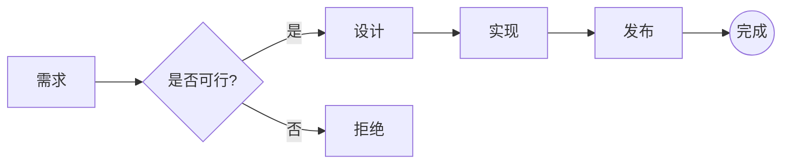

### 序列图 Sequence

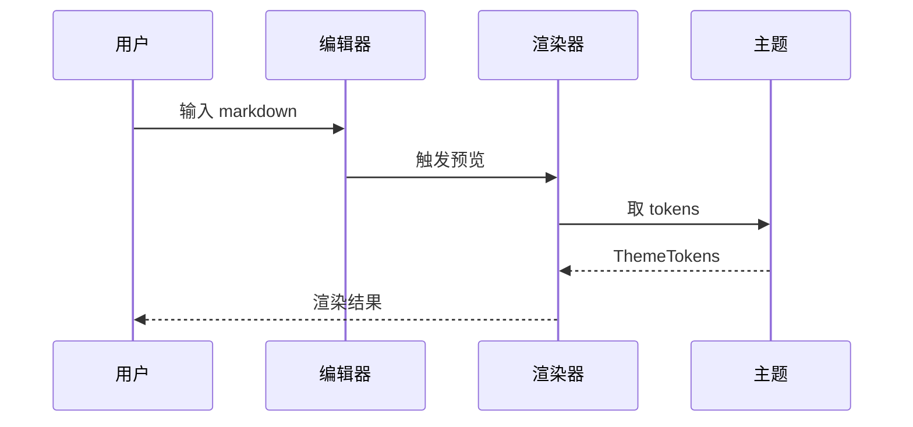

### Mermaid 控制语法：子图、样式、分支、并发与里程碑

流程图的方向、子图、节点形状、边标签、class 与 linkStyle：

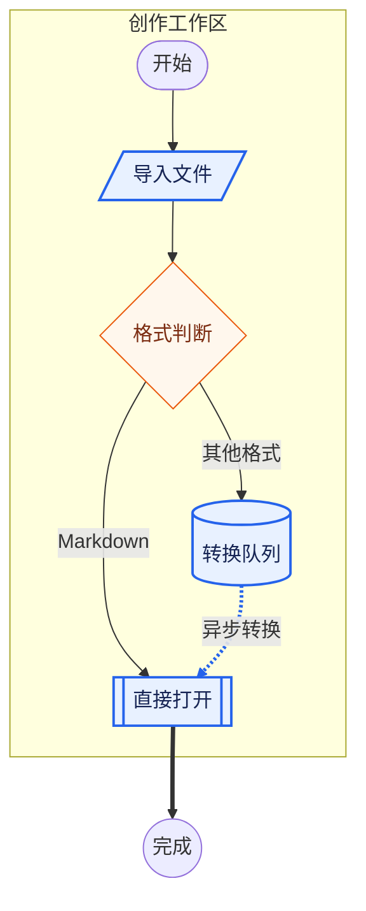

序列图的 autonumber、激活、loop、alt、opt、par、critical、break 与背景块：

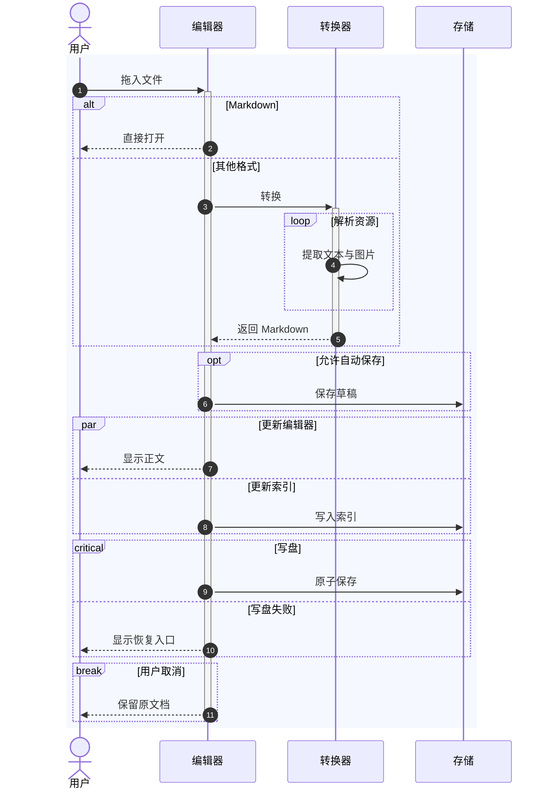

复合状态、choice、fork/join 与并发区域：

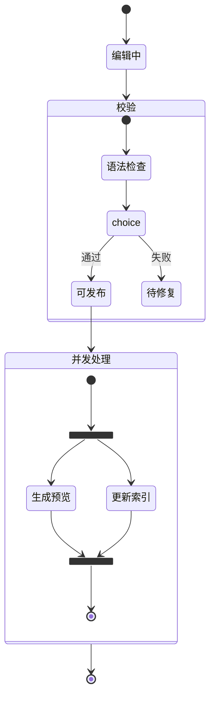

甘特图的 excludes、done、active、crit 与 milestone：

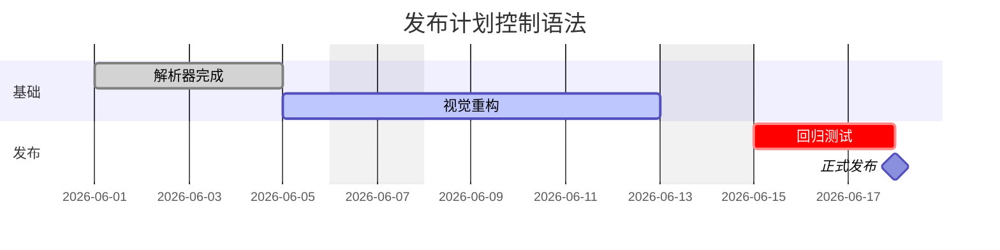

ER 基数与属性约束：

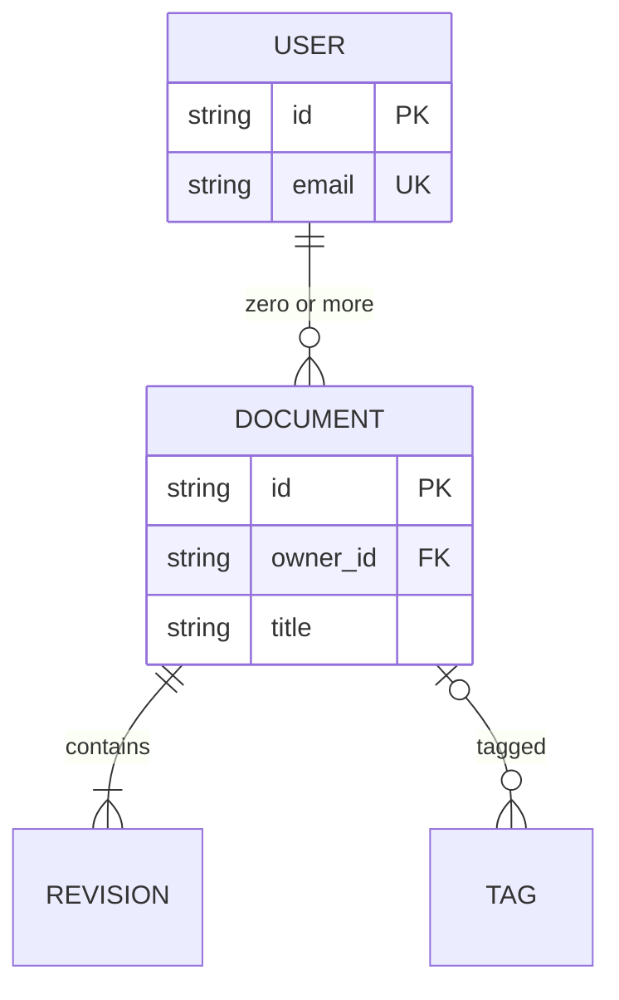

### 甘特图 Gantt

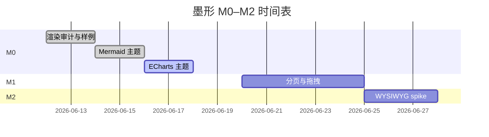

### 饼图 Pie（验证系列色板）

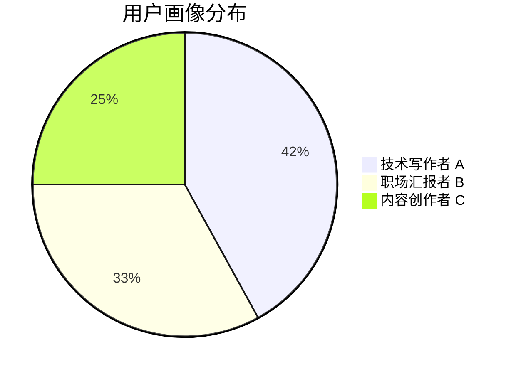

### 类图 Class

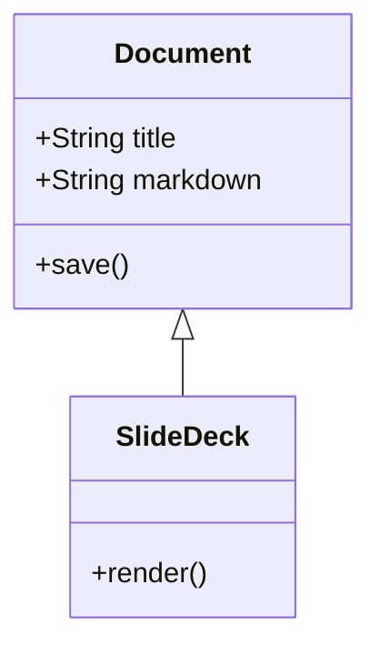

### 状态图 State

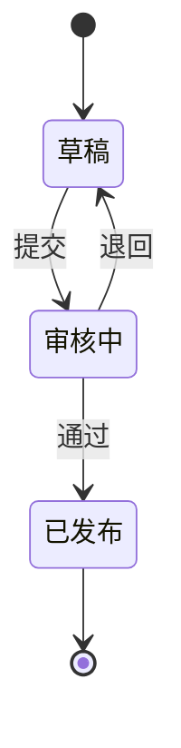

### 实体关系图 ER

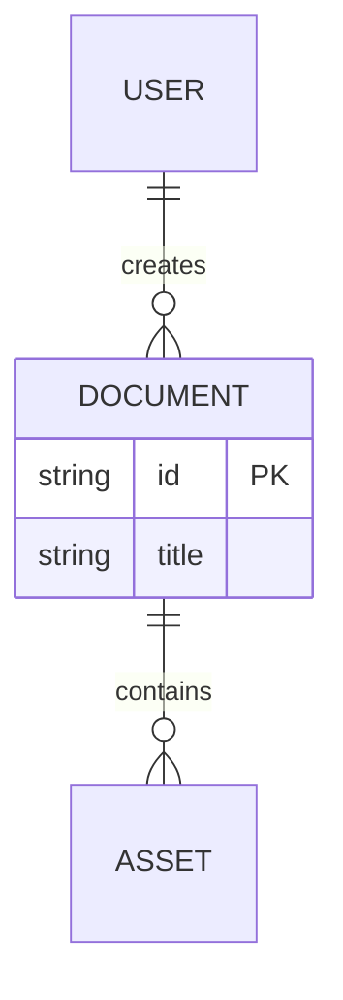

### 用户旅程 Journey

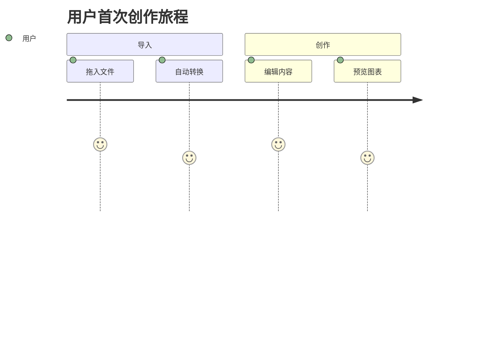

### 象限图 Quadrant

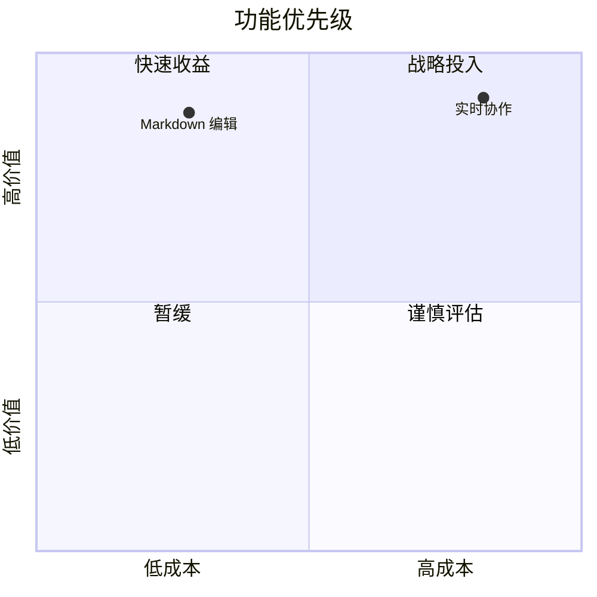

### 需求图 Requirement

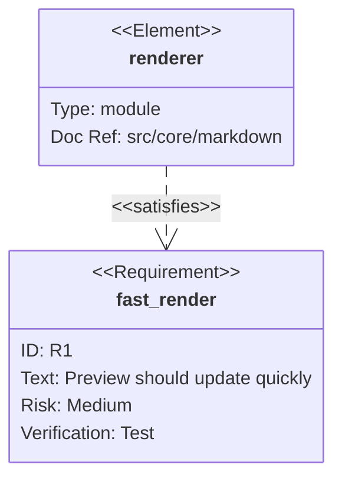

### Git 图 GitGraph

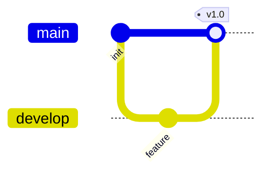

### C4 架构图

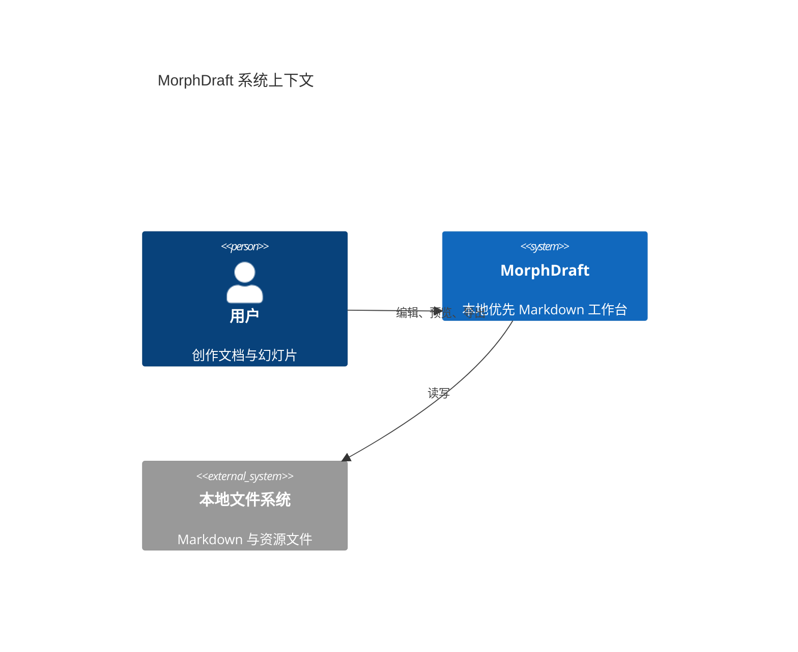

### 思维导图 Mindmap

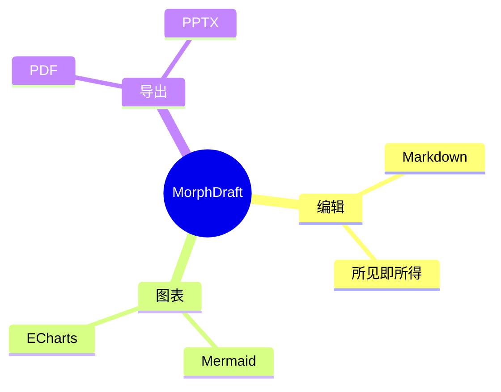

### 时间线 Timeline

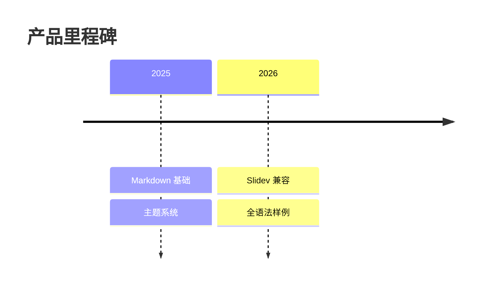

### 桑基图 Sankey

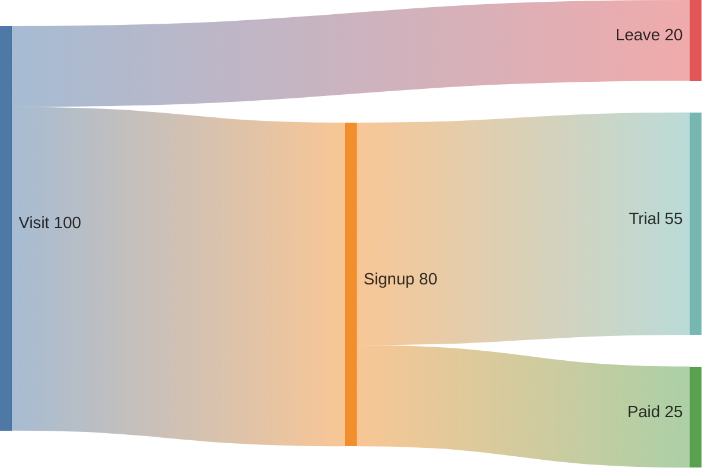

### XY 图

```mermaid
xychart-beta
  title "月活趋势"
  x-axis [Jan, Feb, Mar, Apr]
  y-axis "用户数" 0 --> 100
  bar [30, 45, 62, 78]
  line [28, 48, 60, 82]
```

### 块图 Block

```mermaid
block-beta
  columns 3
  editor["编辑器"] preview["预览"] export["导出"]
  editor --> preview
  preview --> export
```

### 数据包 Packet

```mermaid
packet-beta
  0-15: "源端口"
  16-31: "目标端口"
  32-63: "序列号"
  64-95: "确认号"
```

### 看板 Kanban

```mermaid
kanban
  todo[待办]
    task1[补齐样例]
    task2[视觉回归]
  doing[进行中]
    task3[主题优化]
  done[完成]
    task4[基础渲染]
```

### 架构图 Architecture

```mermaid
architecture-beta
  group app(cloud)[Application]
  service editor(server)[Editor] in app
  service store(database)[Storage] in app
  service export(disk)[Export] in app
  editor:R --> L:store
  editor:B --> T:export
```

### 雷达图 Radar

```mermaid
radar-beta
  title 编辑器能力
  axis speed["速度"], design["设计"], export["导出"], syntax["语法"]
  curve current["当前"]{85, 72, 88, 95}
  curve target["目标"]{95, 90, 95, 98}
  max 100
```

### 事件建模 Event Modeling

```mermaid
eventmodeling
  timeframe 01 ui Editor
  timeframe 02 command SaveDocument
  timeframe 03 event DocumentSaved
  timeframe 04 readmodel DocumentList
```

### 矩形树图 Treemap

```mermaid
treemap-beta
  "导出"
    "PDF": 35
    "PPTX": 30
    "HTML": 20
    "图片": 15
```

### 韦恩图 Venn

```mermaid
venn-beta
  set A["Markdown"]
  set B["幻灯片"]
  union A,B["MorphDraft"]
```

### 鱼骨图 Ishikawa

```mermaid
ishikawa-beta
  "幻灯片不够美观"
    "视觉系统"
      "字体层级弱"
      "装饰不足"
    "布局"
      "留白单一"
      "内容密度失控"
    "实现"
      "未移植主题组件"
```

### Wardley 战略地图

```mermaid
wardley-beta
  title Document Product Value Chain
  anchor User [0.95, 0.95]
  component Authoring [0.82, 0.62]
  component MarkdownEngine [0.58, 0.72]
  component LocalStorage [0.35, 0.88]
  User -> Authoring
  Authoring -> MarkdownEngine
  MarkdownEngine -> LocalStorage
```

### 目录树 TreeView

```mermaid
treeView-beta
  "morphdraft"
    "src"
      "components"
      "core"
      "styles"
    "samples"
      "full-syntax.md"
```

---

## 图表：echarts（应跟随主题）

柱图：

```echarts
{
  "title": { "text": "季度营收（万元）", "left": "center" },
  "tooltip": { "trigger": "axis" },
  "legend": { "bottom": 0, "data": ["实际", "预算"] },
  "grid": { "left": 40, "right": 20, "top": 50, "bottom": 50 },
  "xAxis": { "type": "category", "data": ["Q1", "Q2", "Q3", "Q4"] },
  "yAxis": { "type": "value" },
  "series": [
    { "name": "实际", "type": "bar", "data": [120, 200, 150, 230] },
    { "name": "预算", "type": "bar", "data": [100, 180, 170, 200] }
  ]
}
```

折线图（含多 series、面积、标记）：

```echarts
{
  "title": { "text": "活跃用户走势" },
  "tooltip": { "trigger": "axis" },
  "legend": { "bottom": 0 },
  "grid": { "left": 40, "right": 20, "top": 50, "bottom": 50 },
  "xAxis": { "type": "category", "data": ["1月","2月","3月","4月","5月","6月"] },
  "yAxis": { "type": "value" },
  "series": [
    { "name": "DAU", "type": "line", "smooth": true, "data": [820, 932, 901, 934, 1290, 1330] },
    { "name": "WAU", "type": "line", "smooth": true, "areaStyle": {}, "data": [1820, 2032, 2101, 2434, 3290, 3530] }
  ]
}
```

饼图（验证 8 色系列）：

```echarts
{
  "title": { "text": "导出格式偏好", "left": "center" },
  "tooltip": { "trigger": "item" },
  "legend": { "bottom": 0 },
  "series": [{
    "type": "pie",
    "radius": ["40%", "70%"],
    "data": [
      { "name": "HTML", "value": 35 },
      { "name": "PDF",  "value": 25 },
      { "name": "Word", "value": 18 },
      { "name": "PPTX", "value": 12 },
      { "name": "公众号", "value": 10 }
    ]
}]
}
```

散点图：

```echarts
{
  "title": { "text": "投入与产出" },
  "xAxis": { "name": "投入" },
  "yAxis": { "name": "产出" },
  "series": [{ "type": "scatter", "symbolSize": 16, "data": [[10,8],[18,15],[25,30],[36,42]] }]
}
```

涟漪散点图：

```echarts
{
  "xAxis": { "type": "category", "data": ["北京","上海","深圳","杭州"] },
  "yAxis": { "type": "value" },
  "series": [{ "type": "effectScatter", "rippleEffect": { "scale": 3 }, "data": [82,95,88,76] }]
}
```

雷达图：

```echarts
{
  "radar": { "indicator": [
    { "name": "性能", "max": 100 }, { "name": "易用", "max": 100 },
    { "name": "设计", "max": 100 }, { "name": "导出", "max": 100 }
  ]},
  "series": [{ "type": "radar", "data": [{ "name": "当前", "value": [86,90,78,92] }] }]
}
```

树图：

```echarts
{
  "series": [{ "type": "tree", "data": [{
    "name": "MorphDraft", "children": [
      { "name": "编辑", "children": [{ "name": "Markdown" }, { "name": "预览" }] },
      { "name": "导出", "children": [{ "name": "PDF" }, { "name": "PPTX" }] }
    ]
  }], "symbolSize": 10, "label": { "position": "left" } }]
}
```

矩形树图：

```echarts
{
  "series": [{ "type": "treemap", "data": [
    { "name": "编辑", "value": 40 }, { "name": "图表", "value": 30 },
    { "name": "导出", "value": 20 }, { "name": "存储", "value": 10 }
  ] }]
}
```

旭日图：

```echarts
{
  "series": [{ "type": "sunburst", "radius": ["15%","85%"], "data": [
    { "name": "创作", "children": [{ "name": "编辑", "value": 4 }, { "name": "预览", "value": 3 }] },
    { "name": "交付", "children": [{ "name": "PDF", "value": 2 }, { "name": "PPTX", "value": 2 }] }
  ] }]
}
```

箱线图：

```echarts
{
  "xAxis": { "type": "category", "data": ["A","B","C"] },
  "yAxis": { "type": "value" },
  "series": [{ "type": "boxplot", "data": [[10,20,30,40,50],[15,22,31,45,60],[8,18,28,38,48]] }]
}
```

K 线图：

```echarts
{
  "xAxis": { "type": "category", "data": ["周一","周二","周三","周四"] },
  "yAxis": { "scale": true },
  "series": [{ "type": "candlestick", "data": [[20,34,10,38],[40,35,30,50],[31,38,28,44],[38,15,5,42]] }]
}
```

热力图：

```echarts
{
  "tooltip": {},
  "xAxis": { "type": "category", "data": ["一","二","三"] },
  "yAxis": { "type": "category", "data": ["上午","下午","晚上"] },
  "visualMap": { "min": 0, "max": 10, "calculable": true, "orient": "horizontal", "left": "center" },
  "series": [{ "type": "heatmap", "data": [[0,0,2],[1,0,7],[2,0,5],[0,1,8],[1,1,4],[2,1,9],[0,2,3],[1,2,6],[2,2,10]] }]
}
```

平行坐标：

```echarts
{
  "parallelAxis": [
    { "dim": 0, "name": "速度" }, { "dim": 1, "name": "质量" }, { "dim": 2, "name": "成本" }
  ],
  "parallel": { "left": 50, "right": 50 },
  "series": [{ "type": "parallel", "data": [[90,80,40],[70,95,65],[85,75,55]] }]
}
```

路径线：

```echarts
{
  "xAxis": { "min": 0, "max": 100 }, "yAxis": { "min": 0, "max": 100 },
  "series": [{ "type": "lines", "coordinateSystem": "cartesian2d",
    "data": [{ "coords": [[10,20],[45,70],[90,35]] }], "effect": { "show": true } }]
}
```

关系图：

```echarts
{
  "series": [{ "type": "graph", "layout": "force", "roam": true,
    "data": [{ "name": "编辑" }, { "name": "预览" }, { "name": "导出" }, { "name": "存储" }],
    "links": [
      { "source": "编辑", "target": "预览" }, { "source": "预览", "target": "导出" },
      { "source": "编辑", "target": "存储" }
    ]
  }]
}
```

桑基图：

```echarts
{
  "series": [{ "type": "sankey",
    "data": [{ "name": "访问" }, { "name": "试用" }, { "name": "付费" }, { "name": "离开" }],
    "links": [
      { "source": "访问", "target": "试用", "value": 80 },
      { "source": "访问", "target": "离开", "value": 20 },
      { "source": "试用", "target": "付费", "value": 35 }
    ]
  }]
}
```

漏斗图：

```echarts
{
  "series": [{ "type": "funnel", "left": "15%", "width": "70%", "data": [
    { "value": 100, "name": "访问" }, { "value": 70, "name": "注册" },
    { "value": 42, "name": "试用" }, { "value": 20, "name": "付费" }
  ] }]
}
```

仪表盘：

```echarts
{
  "series": [{ "type": "gauge", "progress": { "show": true }, "detail": { "formatter": "{value}%" },
    "data": [{ "value": 82, "name": "完成率" }] }]
}
```

象形柱图：

```echarts
{
  "xAxis": { "type": "category", "data": ["编辑","预览","导出"] },
  "yAxis": { "type": "value" },
  "series": [{ "type": "pictorialBar", "symbol": "roundRect", "symbolRepeat": true,
    "symbolSize": [18,8], "data": [12,9,7] }]
}
```

主题河流图：

```echarts
{
  "singleAxis": { "type": "time", "top": 30, "bottom": 30 },
  "series": [{ "type": "themeRiver", "data": [
    ["2026/01/01",10,"编辑"], ["2026/02/01",18,"编辑"], ["2026/03/01",15,"编辑"],
    ["2026/01/01",6,"图表"], ["2026/02/01",12,"图表"], ["2026/03/01",20,"图表"]
  ] }]
}
```

### ECharts option 组件与组合能力

`dataset + encode + transform + dataZoom + toolbox + axisPointer + markPoint/markLine/markArea`：

```echarts
{
  "title": { "text": "数据集、缩放与标记组件", "subtext": "dataset → encode" },
  "legend": { "top": 30 },
  "tooltip": { "trigger": "axis", "axisPointer": { "type": "cross" } },
  "toolbox": { "show": true, "feature": { "dataZoom": {}, "restore": {}, "saveAsImage": {} } },
  "dataset": [
    {
      "id": "raw",
      "source": [
        ["month", "收入", "成本"],
        ["一月", 120, 78],
        ["二月", 182, 103],
        ["三月", 191, 116],
        ["四月", 234, 142],
        ["五月", 290, 175],
        ["六月", 330, 201]
      ]
    },
    {
      "id": "filtered",
      "fromDatasetId": "raw",
      "transform": { "type": "filter", "config": { "dimension": "收入", ">=": 180 } }
    }
  ],
  "grid": { "left": 48, "right": 24, "top": 80, "bottom": 62 },
  "xAxis": { "type": "category" },
  "yAxis": { "type": "value" },
  "dataZoom": [
    { "type": "inside", "start": 0, "end": 100 },
    { "type": "slider", "bottom": 15, "height": 20 }
  ],
  "series": [
    {
      "name": "收入",
      "type": "bar",
      "encode": { "x": "month", "y": "收入" },
      "markPoint": { "data": [{ "type": "max", "name": "最高" }] },
      "markLine": { "data": [{ "type": "average", "name": "平均" }] }
    },
    {
      "name": "成本",
      "type": "line",
      "smooth": true,
      "encode": { "x": "month", "y": "成本" },
      "markArea": { "data": [[{ "name": "观察区间", "xAxis": "三月" }, { "xAxis": "五月" }]] }
    },
    {
      "name": "筛选后收入",
      "type": "line",
      "datasetId": "filtered",
      "encode": { "x": "month", "y": "收入" }
    }
  ]
}
```

`visualMap + calendar + graphic`：

```echarts
{
  "title": { "text": "日历热力与图形标注", "left": "center" },
  "tooltip": { "position": "top" },
  "visualMap": {
    "min": 0,
    "max": 100,
    "calculable": true,
    "orient": "horizontal",
    "left": "center",
    "bottom": 10
  },
  "calendar": {
    "top": 70,
    "left": 35,
    "right": 20,
    "cellSize": ["auto", 18],
    "range": "2026-06"
  },
  "graphic": [
    {
      "type": "text",
      "right": 20,
      "top": 20,
      "style": { "text": "MorphDraft Activity", "fontSize": 12, "fill": "#64748b" }
    }
  ],
  "series": [{
    "type": "heatmap",
    "coordinateSystem": "calendar",
    "data": [
      ["2026-06-01", 18], ["2026-06-02", 42], ["2026-06-03", 75],
      ["2026-06-04", 33], ["2026-06-05", 91], ["2026-06-06", 64],
      ["2026-06-07", 27], ["2026-06-08", 58], ["2026-06-09", 80]
    ]
  }]
}
```

`timeline + options + brush`（时间轴配置切换多组 option）：

```echarts
{
  "baseOption": {
    "timeline": {
      "axisType": "category",
      "autoPlay": false,
      "data": ["2024", "2025", "2026"]
    },
    "title": { "subtext": "年度能力变化" },
    "tooltip": {},
    "brush": { "toolbox": ["rect", "polygon", "clear"], "xAxisIndex": "all" },
    "xAxis": { "type": "category", "data": ["编辑", "图表", "幻灯片", "导出"] },
    "yAxis": { "type": "value", "max": 100 },
    "series": [{ "type": "bar" }]
  },
  "options": [
    { "title": { "text": "2024" }, "series": [{ "data": [55, 20, 15, 32] }] },
    { "title": { "text": "2025" }, "series": [{ "data": [78, 62, 48, 65] }] },
    { "title": { "text": "2026" }, "series": [{ "data": [92, 88, 86, 90] }] }
  ]
}
```

---

## 引用与脚注收尾

正文中可使用脚注 [^fn1]，也可多次引用同一脚注 [^fn1]，或引用另一个 [^fn2]。

水平线（应在主题色下保持纤细）：

---

文末测试：长单词与长 URL 的折行
`abcdefghijklmnopqrstuvwxyzabcdefghijklmnopqrstuvwxyz` `https://very.long.subdomain.example.com/path/segment/one/two/three/four/five/six?query=value&another=value2`

[^fn1]: 第一个脚注：用于验证脚注号样式、回跳箭头与文末区块布局。
[^fn2]: 第二个脚注：含 **加粗** 与 `代码` 的脚注内容。
[^multi]: 第一段脚注，验证多段脚注定义。

    第二段脚注使用四空格缩进，可包含列表：

    - 子项一
    - 子项二
