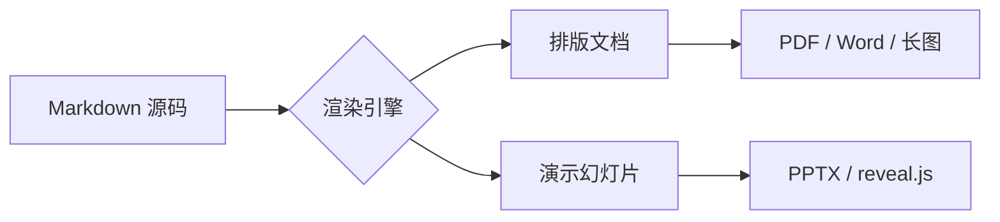

# 内容工具趋势观察 · 2025

> 从「能写」到「会表达」——下一代写作工具，正把排版、图表与演示揉进同一份 Markdown。

:::kpi
- **3.2×** 创作到成稿提速
- **87%** 用户偏好本地优先
- **0** 服务端依赖
:::

## 一、为什么是现在

过去十年，写作工具完成了从 **富文本** 到 **Markdown** 的回归：人们重新爱上「内容与样式分离」的确定感。而 2025 年的拐点在于——*同一份内容，要同时服务文档与演示两种场景*。

正文里的 **加粗**、*斜体*、~~删除线~~、<u>下划线</u>、==高亮==，行内 `code`，以及上标 E=mc^2^ 与下标 H~2~O，都应当自然成形。

> 「工具的终局，是让人忘记工具本身。」
>
> > 而忘记的前提，是它从不打断你的心流。

## 二、关键能力对比

| 能力 | 传统富文本 | 纯 Markdown | 新一代 · 本地优先 |
| :-- | :-: | :-: | :-: |
| 内容可迁移 | 弱 | **强** | **强** |
| 直出演示 | 手动 | — | 自动 |
| 数据隐私 | 取决于云 | 本地 | **纯本地** |
| 图表 / 公式 | 插件 | 受限 | 原生 |

进度一览（行内组件，可直接写在单元格里）：

| 方向 | 进度 | 趋势 | 状态 |
| --- | --- | --- | --- |
| 模板库 | ((bar:92)) | ((spark:3,5,4,7,8,9)) | ((green:收尾)) |
| 协作流 | ((bar:64)) | ((spark:6,4,5,5,7,6)) | ((blue:进行中)) |
| 数据洞察 | ((bar:38)) | ((spark:2,3,2,4,3,5)) | ((amber:启动)) |

## 三、一份内容，两种成品

一份 Markdown 如何同时长出「文档」与「幻灯片」：



## 四、增长信号

近四个季度，「写文档」与「做演示」两类需求同步上扬：

```echarts
{
  "tooltip": {},
  "legend": { "data": ["文档", "演示"] },
  "xAxis": { "type": "category", "data": ["Q1", "Q2", "Q3", "Q4"] },
  "yAxis": { "type": "value" },
  "series": [
    { "name": "文档", "type": "bar", "data": [120, 160, 180, 240] },
    { "name": "演示", "type": "line", "smooth": true, "data": [60, 110, 150, 220] }
  ]
}
```

## 五、把体验写成公式

阅读体验可用「信息密度 × 视觉舒适度」近似衡量：

$$ Q = \sum_{i=1}^{n} w_i \cdot \frac{c_i}{1 + e^{-d_i}} $$

其中 $w_i$ 为各段权重，$c_i$ 为信息量，$d_i$ 为视觉间距——*留白，本身也是信息*。

## 六、一段代码的样子

```ts
// 同一份内容，导出多种成品
type Target = 'pdf' | 'pptx' | 'docx' | 'image'

export function compose(md: string, to: Target) {
  const blocks = parse(md)            // 解析为块级结构
  return render(blocks, theme[to])    // 按目标套用主题
}
```

## 七、落地清单

- [x] 选定本地优先的编辑器
- [x] 统一团队 Markdown 写作规范
- [ ] 沉淀主题与版式模板库
- [ ] 打通导出到周报 / 公众号

:::tip
小步快跑：先用默认主题跑通「写 → 预览 → 导出」闭环，再逐步沉淀模板。
:::

:::warning
跨工具粘贴富文本时，优先「粘为 Markdown」，避免样式污染源码。
:::

:::note
本文为示例文档，用于展示**文档模式**的排版能力；数据均为示意。[^1]
:::

[^1]: 趋势与数字为演示用途，非真实统计。
